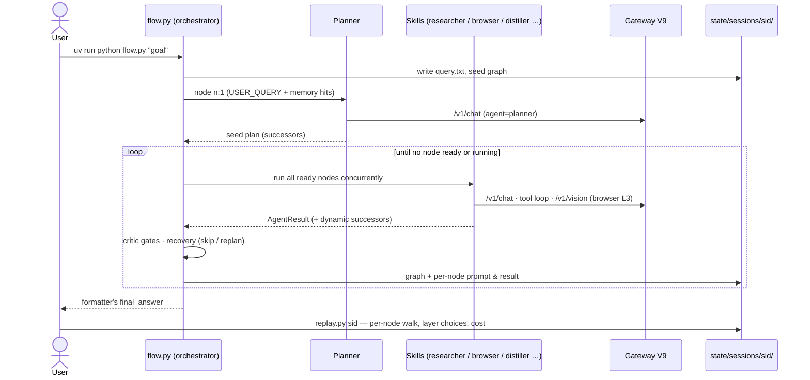

# Architecture

How the repo-genesis starter codebase is put together: the agent runtime, the skill
catalogue, the Browser skill, and the Gateway — and, explicitly, **where new
functionality plugs in versus what must not change**.

> Companion: [`course/index.html`](../course/index.html) teaches the same material as an
> interactive course. This note is the reference version.

---

## At a glance

Two independent programs talk over HTTP, and every run leaves a paper trail:

```
┌─────────────────────────────┐         ┌─────────────────────────────┐
│  Agent  (code/)             │  HTTP   │  Gateway V9  (gateway/)     │
│  flow.py orchestrator       │ ──────► │  :8109                      │
│  skills + prompts + memory  │         │  7 providers, rate limits,  │
│  browser cascade            │         │  routing, cost ledger       │
└──────────────┬──────────────┘         └─────────────────────────────┘
               │ writes
               ▼
   code/state/sessions/<sid>/   (graph, per-node prompts/results, screenshots)
```

| Path | What it is |
|---|---|
| `code/flow.py` | The orchestrator — a growing NetworkX DAG of skill nodes. **Do not modify.** |
| `code/skills.py` | Skill registry + per-node dispatch (loads the catalogue, renders prompts, parses replies) |
| `code/agent_config.yaml` | **The skill catalogue.** One entry per skill. This is the extension point. |
| `code/prompts/*.md` | One system prompt per skill — the other half of each skill's definition |
| `code/browser/` | The Browser skill: four-layer cascade over Playwright |
| `code/memory.py`, `vector_index.py`, `artifacts.py` | FAISS-backed memory, vector index, content-addressed blob store |
| `code/recovery.py` | Failure classification + skip/replan policy |
| `code/persistence.py`, `replay.py` | Per-session on-disk state; stdin-driven replay viewer |
| `code/mcp_runner.py`, `mcp_server.py` | Tool-use loop + the MCP tools (`web_search`, `fetch_url`, `search_knowledge`, …) |
| `code/gateway.py` | Agent-side bridge: auto-starts the gateway, re-exports the `LLM` client and `embed()` |
| `gateway/` | Gateway V9 — the only place provider keys, rate limits, and costs live |
| `code/agent7_s7_carryover.py` + `perception.py` / `decision.py` / `action.py` | **Legacy**: the Session-7 single-loop agent, kept for reference. Not on the S8 execution path (`flow.py` imports none of them). |

---

## 1. Agent flow (`code/flow.py` and friends)

### The growing graph

The agent's plan is a NetworkX `DiGraph`. Each node is one **skill invocation**
(`skill`, `inputs`, `metadata`, `status`); edges carry typed `AgentResult` payloads.
The graph is seeded with a single node — the Planner, wired to `USER_QUERY` — and
**grows at runtime** through exactly five mechanisms:

1. **Planner seed plan** — the Planner reads the goal and emits the first batch of nodes.
2. **Dynamic successors** — any skill may return `successors` in its JSON reply; the
   orchestrator splices them in (label-based input references are resolved per batch).
3. **Static `internal_successors`** — declared in the yaml; e.g. Coder is always
   followed by `sandbox_executor`.
4. **Critic auto-insertion** — when a `critic: true` skill (Distiller) completes, every
   outgoing edge gets a Critic node spliced in; the child runs only on a `pass` verdict.
5. **Recovery re-planning** — on a qualifying failure the Planner is re-invoked with a
   failure report (see §recovery below).

The executor loop is: mark `ready_nodes()` (all predecessors `complete` or `skipped`)
as running, execute them **concurrently** with `asyncio.gather`, record results, extend
the graph, persist, repeat — until nothing is ready or running. `MAX_NODES = 60` is the
hard cap that keeps a looping Planner finite.

Two contracts worth knowing:

- **Tool-blindness** — the Planner names *skills*, never tools. Which tools a skill may
  call is the catalogue's business (`tools_allowed`).
- **Memory once per session** — `memory.read(query)` runs once at session start and the
  same FAISS-ranked hits are rendered into *every* skill prompt
  (`MEMORY HITS` block in `skills.render_prompt`).

### Per-node dispatch (`code/skills.py`)

`run_skill()` resolves the node's inputs (`USER_QUERY`, `n:<id>` upstream outputs,
`art:<sha>` artifact bytes, literals), renders the prompt
(template + QUESTION + FAILURE + MEMORY HITS + INPUTS), then dispatches one of four ways:

| Skill | Path |
|---|---|
| `sandbox_executor` | Bypasses the LLM — runs the upstream Coder's code via `sandbox.run_python` |
| `browser` | Bypasses the chat channel — hands a `NodeSpec` to `BrowserSkill.run()` (§3) |
| any skill with `tools_allowed` | Multi-turn tool loop via `mcp_runner.run_with_tools` (one MCP stdio session per invocation) |
| everything else | Single `LLM().chat()` call through the gateway, tagged `agent=<skill name>` |

Replies must be a single JSON object; `successors` are validated as `NodeSpec` and a
malformed spec **fails the node loudly** (it used to be silently dropped).

### Memory and artifacts

`memory.py` is a typed service (kinds: `fact`, `preference`, `tool_outcome`,
`scratchpad`). Reads go FAISS-first (cosine over 768-dim embeddings via the gateway's
`/v1/embed`), falling back to keyword overlap. `artifacts.py` is a content-addressed
blob store (`art:<sha>` handles): big tool outputs (> 4 KB) live there as bytes, while
prompts carry only handles and short descriptors.

### Recovery (`code/recovery.py`)

`classify_failure(error_text)` buckets every node failure, and `plan_recovery()` maps
the bucket to an action:

| Failure | Action | Why |
|---|---|---|
| `transient` (5xx, timeout, connection) | **skip** | the gateway already retried; a new plan can't fix a busy server |
| `validation_error` (malformed NodeSpec) | **skip** | that's a prompt bug — fix the prompt file, not the run |
| `upstream_failure`, failed skill = planner | **skip** | never ask the Planner to recover the Planner |
| `upstream_failure`, any other skill | **replan** | re-invoke the Planner with a failure report **plus the ids of already-completed nodes** so the detour reuses finished work |

Critic-fail is handled separately (`handle_critic_verdict`): the gated child is marked
`skipped`, one recovery Planner is spliced in **per target, once** — a second rejection
hits the cap, the branch is abandoned, and the final log prints a warning naming it.

### Persistence and replay

`persistence.SessionStore` writes `state/sessions/<sid>/` with atomic-rename semantics:
the graph pickle/JSON, `query.txt`, and one `nodes/n_*.json` per node containing the
**exact rendered prompt** and the full result. `flow.py --resume <sid>` reloads the
graph, flips `running` → `pending`, and continues. `replay.py <sid>` walks the run
node-by-node (keys: enter = next, `p` = full prompt, `o` = full output).

---

## 2. The skill catalogue — **where extensions go**

A skill is **two files, zero Python classes**:

1. an entry in `code/agent_config.yaml`
2. a system prompt in `code/prompts/<name>.md`

`SkillRegistry` loads the yaml at startup; the orchestrator treats every node uniformly
through that registry. Catalogue fields:

| Field | Meaning |
|---|---|
| `prompt` | path to the skill's system prompt (relative to `code/`) |
| `description` | one-liner shown in dashboards / replay |
| `tools_allowed` | which MCP tools the skill may call (`[]` = text-only) |
| `internal_successors` | nodes the orchestrator always adds after this skill (Coder → `sandbox_executor`) |
| `critic: true` | gate every outgoing edge with an auto-inserted Critic (Distiller) |
| `temperature`, `max_tokens` | per-skill sampling knobs — tuning needs no code edit |
| `provider_pin` | optional preferred provider (most pins live gateway-side in `agent_routing.yaml`) |

**To add a new skill** (this is the complete procedure):

1. Write `code/prompts/<name>.md` — instructions, expected JSON output shape.
2. Add a `<name>:` entry to `code/agent_config.yaml` with the fields above.
3. If the Planner should schedule it, describe it in `code/prompts/planner.md`'s
   "Available skills" list.

No orchestrator edits. No dispatcher edits — unless the skill needs a non-LLM execution
path (like `browser` / `sandbox_executor`), which is the *only* case that touches
`skills.run_skill`.

Shipped catalogue: `planner`, `retriever`, `researcher`, `distiller` (critic-gated),
`summariser`, `critic`, `formatter`, `coder` → `sandbox_executor`, `browser`.

---

## 3. The Browser skill (`code/browser/`)

`skill.py` wraps the layered drivers in the orchestrator's `NodeSpec → AgentResult`
contract and owns the **four-layer cascade** — cheapest first, escalate only on failure,
stop at the first layer that produces a useful answer:

| Layer | Mechanism | LLM cost |
|---|---|---|
| 1 `extract` | plain HTTP GET + trafilatura text extraction | none |
| 2a `deterministic` | caller-supplied `{action, selector, value}` steps replayed via Playwright — only when `metadata.selectors` is given; never guessed | none |
| 2b `a11y` | `A11yDriver`: enumerate interactive elements (`dom.py`), send the *text legend* to `/v1/chat`, act step-by-step | text-only |
| 3 `vision` | `SetOfMarksDriver`: screenshot + numbered boxes painted by `highlight.py` (Pillow, device-pixel-ratio-aware), sent to `/v1/vision` | vision |

Escalation triggers from Layer 1: extracted text < 200 chars, or the goal contains an
interactive verb (`click`, `fill`, `sort`, `filter`, …) — reading can never satisfy an
interaction. Both drivers share the element enumerator, action vocabulary, and loop
machinery (`driver.py`); they differ only in `_decide()` (legend-only vs. legend +
screenshot).

**`gateway_blocked` is a first-class failure**: if any layer detects a CAPTCHA /
Cloudflare interstitial / login wall, the skill returns immediately with
`error_code="gateway_blocked"` and does *not* try higher layers — escalation fixes
"too hard", not "not allowed". The failure report carries the literal token, and the
recovery path re-invokes the Planner to route around the site.

Files: `skill.py` (cascade + block detection), `driver.py` (both drivers), `dom.py`
(single-pass JS enumeration of visible interactives), `highlight.py` (set-of-marks
annotation), `client.py` (framework-free httpx client for `/v1/chat`, `/v1/vision`,
`/v1/cost/by_agent`). Per-turn screenshots land in
`state/sessions/<sid>/browser/…/<layer>/` and the chosen layer surfaces as
`output.path` in the replay.

---

## 4. Gateway V9 (`gateway/`)

One front door for every model call. Seven providers (Gemini, Groq, Cerebras, NVIDIA,
OpenRouter, GitHub Models, local Ollama) behind one API on `:8109`
(`GATEWAY_V9_PORT`):

| Endpoint | Purpose |
|---|---|
| `POST /v1/chat` | main channel — text + multi-turn tool use |
| `POST /v1/chat/batch` | batched chat |
| `POST /v1/vision` | single-image calls (Browser Layer 3) — V9 addition |
| `POST /v1/embed` | 768-dim embeddings (memory / FAISS), Ollama-first with Gemini fallover in the **same vector space** |
| `GET /v1/cost/by_agent` | the ledger sliced per skill/session — tokens, latency, and USD (via `pricing.py`) |
| `GET /v1/status`, `/v1/routers`, `/v1/providers`, `/v1/capabilities`, `/v1/calls` | introspection |

Routing of a `/v1/chat` call, in order:

1. **Explicit `provider=`** from the caller always wins.
2. **`agent_routing.yaml` pin** — maps skill name → preferred provider (Planner →
   gemini, Critic → groq, …). A pin in cooldown waits briefly (≤ 30 s) then falls back;
   it is a preference, not a hard binding.
3. **Tier classification** — a separate `RouterPool` of small/fast providers classifies
   the prompt (TINY vs. LARGE) from a ≤ 800-char sample, choosing a failover order
   (TINY → small fast workers; LARGE → long-context Gemini first).
4. **Capability + rate-limit filter** (`router.py`) — skip providers missing a required
   capability (tools / structured / vision / caching) and providers over their RPM /
   RPD / TPM / cooldown budgets (`LIMITS` table); fall through the ladder.

Every call — success or failure, worker or router — is recorded in the SQLite ledger
(`db.py`) with provider, model, tokens, latency, `agent`, and `session`, which is what
makes the replay's cost summary and `/v1/cost/by_agent` possible. `providers.py` holds
the per-provider adapters (OpenAI-compat family + Gemini + Ollama, including prompted
tool-calling for providers without native support); `cache.py` adds Gemini explicit
prompt caching keyed by SHA-256 of the system text.

The agent never imports a provider SDK: `code/gateway.py` auto-starts the gateway if
it's down and exposes `LLM().chat(...)` / `embed(...)`.

---

## 5. End to end: one run



In prose: the goal seeds a one-node graph → the Planner emits the plan → ready nodes run
concurrently, every LLM call passing through the gateway (tagged with skill + session)
→ Distiller output is critic-gated, failures are triaged into skip-or-replan → the
Formatter's `final_answer` is returned → `replay.py` reconstructs the whole run, layer
choices and cost included, from the session folder.

---

## 6. What must NOT change vs. where extensions go

This is the project's standing constraint (REQ-CON-001: new functionality plugs in
through the skill catalogue; the orchestrator stays untouched).

| 🚫 Frozen — do not modify | ✅ Extension points |
|---|---|
| `code/flow.py` (Graph + Executor) | `code/agent_config.yaml` — add / tune skill entries |
| `code/skills.py` dispatch contract | `code/prompts/*.md` — add / edit skill prompts (incl. teaching the Planner about new skills in `planner.md`) |
| `code/recovery.py` decision table | `gateway/agent_routing.yaml` — re-pin skills to providers (one line, no code) |
| `code/persistence.py` on-disk format | `skills._TOOL_CATALOG` + `code/mcp_server.py` — add a new MCP tool, then grant it via `tools_allowed` |
| `gateway/` core (`main.py`, `router.py`, `providers.py`) | `gateway/.env` / `code/.env` — keys, provider order (`LLM_ORDER`), port |
|  | `code/browser/` cascade knobs via `BrowserSkill(...)` kwargs (steps, wall clock, pins) |

Litmus test: **if your change requires editing `flow.py`, redesign it as a skill.**
The one sanctioned exception is a skill that needs a non-LLM execution path (the
`browser` / `sandbox_executor` pattern), which adds a dispatch branch in
`skills.run_skill` — and nothing else.

No third-party agentic frameworks are used anywhere (REQ-CON-002): the orchestrator is
NetworkX + asyncio, the browser layers are Playwright + Pillow + httpx, and the gateway
is FastAPI — all glue is first-party.
